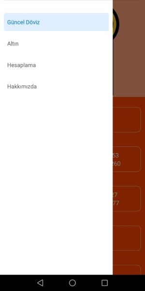
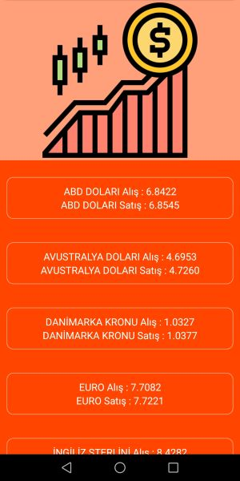
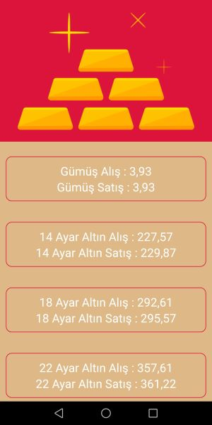
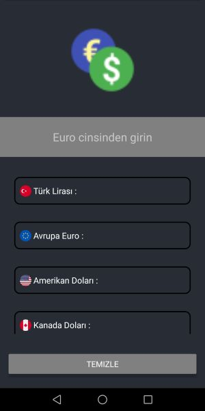

## Actual Currency Converter

This application show that buy and sell values of currencies and golds.You can easily learn currencies by actual and relaible sources.
 
Also this app include that  calculate the response of currencies according to euro.
 
As simple this app happen 3 main section that Actual Currency(Güncel Döviz),Golds(Altın),Calculate(Hesaplama).
 
 

 
#### 1-) Actual Currency(Güncel Döviz)
 
 
 This section show that actual currency by reliable sources learn-easily.
 
 

 

#### 2-) Golds(Altın)
 
 
 
This section show that actual golds buy and sell values.
 
 

 
 
 
<h2> 3-) Calculate(Hesaplama)</h2>
 
 
This section include that calculate the response of currencies according to euro.
 
 

